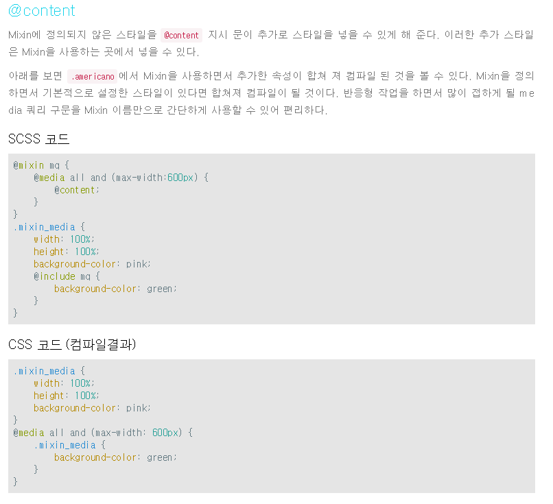

# 1. Nested Rules (중첩 규칙)

Sass는 HTML을 작성하듯이 선택자의 정의 안에 자식 선택자를 정의할 수 있다. 
이와 같은 중첩 규칙으로 Sass를 작성한다면 
<b>부모 선택자가 반복해서 작성하지 않다도 되기때문에 중첩이 많아 지더라도 
코드의 레이아웃을 간결하게 해준다.</b> 
중첩이 깊어지더라도 코드의 레이아웃을 보다 깔끔하게 해주어 가독성이 높아지므로 Css를 정리하기도 편리해 진다.

# 1-1 중첩 사용 시 유의사항

Sass를 처음 사용할 때 가장 흥미를 느낄 수 있는 부분이 바로 중첩이다.  
적용하기 편하고 규칙이 단순해 보이기 때문이다. 그렇기 때문에 <b>남용되기 쉬워 불필요 한 코드가 증가하는 문제점도 있다.</b> 
중첩의 사용은 <b>생성된 선택자의 형태를 고려하여 사용하는 것이 중요</b>하다. 
자칫 무분별하게 중첩을 사용하면 불필요한 선택자가 생성되기 때문이다.

# 2. 부모 선택자 참조(&)

선택자 대신 &기호를 쓰는 방법이 있다 &는 현재 작성 중인 정의의 부모를 참조한다.  
&가 유용한 이유는 <b>가상클래스, 가상요소, 속선 선택자, class나 id</b> 셀텍터를 사용하기에 매우 편리하기 때문이다.

# 3. Variables(변수)

변수는 할당한 값을 CSS파일로 출력하는 것을 말한다. 변수는 CSS와 비교하여 Sass의 편히한 점 중 하나이다. 
Sass에서 변수선언을 $기호를 붙여 <b>$변수명:변수값</b> 과 같은 형태로 선언하면 된다. 
프로젝트에서 공통으로 사용하는 컬러값이나 기본폰트가 설정되어 있지만 몇몇 요소에서 재선언 하여 사용해야하는 폰트값에 사용할 수 있을 것 이다. 
그 외에도 변수는 무궁무진하게 활용된다.

# 4. Mixin

Mixin은 Css에서 반복적으로 사용하는 스타일을 mixin을 통해 재사용 할수 있는 스타일로 정의한다. 
단순하게 Css 규칙만을 적용할 수도 있지만, 인자를 활용하면 반복되는 Css속성을 mixin을 통해  
다양한 곳에서 한 가지 규칙으로 적용할 수 있다. 이 것은 mixin을 정의한 곳에서 mixin울 사용한
다양한 위치에 있는 스타일을 제어할 수 있으므로 관리 상의 이점도 있다.  
@mixin mixin 이름{속성: 속성값}으로 정의한다. mixin은 부모 선택자 참조(&)를 포함할 수 있다. 
Mixin을 호출하는 방법은 @include mixin 이름으로 정의한다.  
@include를 사용하여 mixin의 이름과 인자 값을 전달하면 사용한 규칙에 mixin에 정의한 스타일이 포함된다.

# 5. Extend

<b>@extend</b>는 같은 형태에서 약간의 변형이 생겼을 경우에 유용하게 사용할 수 있다. 
Sass를 사용하지 않았을 때 다중 클래스를 사용하거나 Css에서 공통으로 사용하는 속성을 모아 선언하기도 했을 것이다.  
<b>@extend</b>는 직접 공통된 속성을 모아 선언하던 것을 편리하게 사용할 수 있게 한다. 
<b>@extend</b>의 사용방법은 <b>@extend class명</b> 또는 <b>@extend %placeholder명</b>으로 
선언하여 사용한다. <b>@extend</b> 중첩 안에 여러 개를 선언해도 된다. 여러 개를 선언 할때 쉼표로 구분하여 사용할 수도 있다. 

# 6. Placeholder

.americano_ice 클래스에는 .americano에 선언된 속성들이 모두 포함되어 있다.  
class 형식만<b>@extend</b> 할 수 있는 것이 아니라, 공통된 속성을 따로 선언하여 가져와 사용할 수도 있다. 
 공통된 속성을 따로 선언한 것을 <b>%placeholder</b>라고 한다. 

 
 ## 예제

출처 : http://hwangsunsoo.org/lecture/src/sass_article_seminar_2017_2nd_half.html

# 7. Extend 와 Mixin 차이점

Mixin은 속성은 같으나 값이 다를때,  
Extend는 속성과 값이 완전히 다 같은 코드를 여러군데 쓰고 싶을때 사용합니다.

출처 : https://blog.naver.com/wlwl16/221291804704